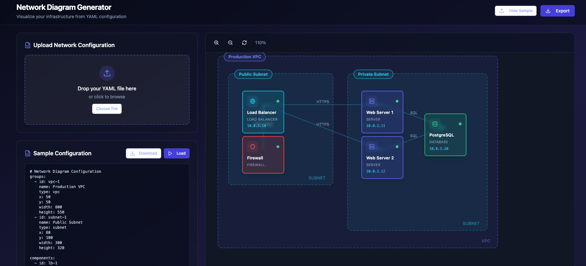

# Network Diagram Generator

**network-diagram-generator** is a tool that creates network diagrams directly from YAML files.

Instead of manually drawing and constantly updating network diagrams, you define your network once in YAML and let this tool generate the diagram for you.

---

## Why This Tool Exists

Let’s be honest:

1. **Network diagrams suck**  
   They’re annoying to create and usually outdated almost immediately.

2. **Network diagrams are tedious and repetitive**  
   Small architecture changes often require large manual redraws.

3. **There are very few tools that generate network diagrams from YAML**  
   Infrastructure is code, but diagrams are still mostly manual.

This tool aims to fix that.

---

## What It Does

- Reads a **YAML file** that describes your network
- Automatically generates a **visual network diagram**
- Makes updates fast—change the YAML, regenerate the diagram

---

## Typical Workflow

1. Define your network architecture in a YAML file
2. Run the network diagram generator
3. Share or document the generated diagram
4. Update the YAML as your architecture evolves

---

## Roadmap 🚧

### Planned Enhancements
- **90-degree network connections** for cleaner, more traditional diagram layouts

### Future Ideas
- Automatic layout optimization (fewer overlaps and crossings)
- Logical grouping (VPCs, subnets, availability zones, environments)
- Multiple diagram themes (dark mode, print-friendly)
- Export options (PNG, SVG, PDF)
- Live preview when YAML files change
- YAML schema validation and linting
- Support for common network and cloud icons
- CLI support for automation and CI/CD pipelines

---

## Design Philosophy

- Diagrams should be **generated artifacts**, not hand-drawn
- **YAML is the source of truth**
- Regenerating diagrams should be fast and painless

---

## Usage

### How to Run in Dev

npm run dev

http://localhost:5173

### How to Run in Production

npm run build

---

## Contributing

Contributions are welcome—especially from anyone who’s ever said,  
“Why am I still drawing network diagrams by hand?”
